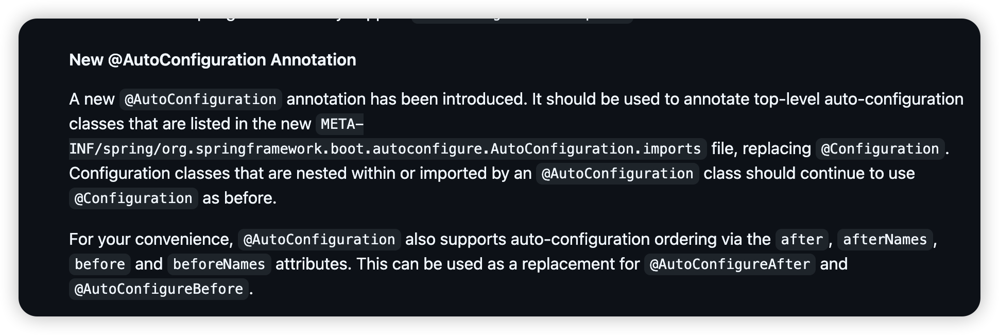

> Spring autoConfiguration 不生效原因

 

发现已经变更了自动导入配置，做以下操作即可。

使用spring/org.springframework.boot.autoconfigure.AutoConfiguration.imports代替

spring.factories中的org.springframework.boot.autoconfigure.EnableAutoConfiguration

